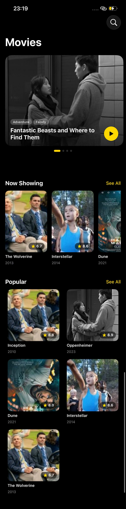
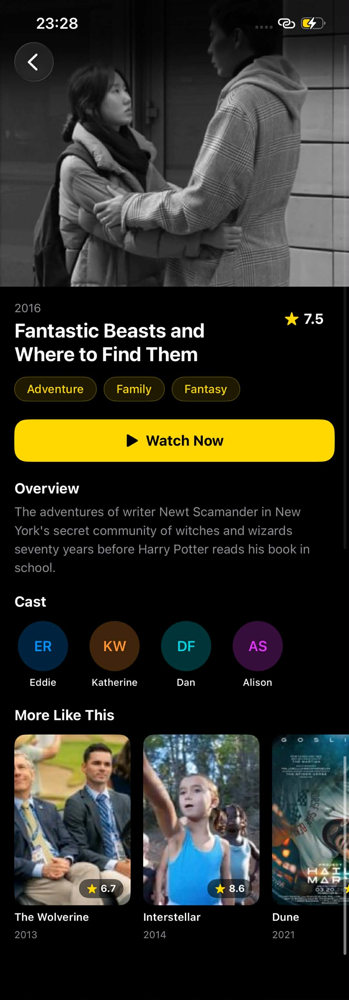

# 🎬 Movie App — iOS

A SwiftUI movie browsing app with a clean dark UI, featured carousel, now showing, and popular sections.

---

## 📱 Screenshots

&nbsp;&nbsp;

---

## 🗂 Project Structure

```
MovieMultiModuleApp/
├── MovieMultiModuleApp/
│   ├── Models/
│   │   └── MockMovie.swift           # Movie data model & mock data
│   ├── Presentation/
│   │   ├── Home/
│   │   │   ├── HomeView.swift        # Main screen (Featured, Now Showing, Popular)
│   │   │   └── FeaturedMovieCard.swift
│   │   ├── Detail/
│   │   │   └── MovieDetailView.swift # Movie detail screen
│   │   └── Components/
│   │       ├── MovieCard.swift       # Reusable movie card
│   │       └── CastCard.swift        # Reusable cast avatar card
│   └── ContentView.swift
└── Packages/
    ├── MovieData/                    # Data layer module
    └── MovieDomain/                  # Domain layer module
```

---

## ✨ Features

- **Featured Carousel** — full-width paged scroll with animated dot indicator
- **Now Showing** — horizontal scroll of current movies with ratings
- **Popular** — 2-column grid layout
- **Movie Detail** — poster, genres, overview, cast, and "More Like This" section
- **Dark theme** with yellow accent throughout

---

## 🛠 Tech Stack

| | |
|---|---|
| **Language** | Swift 5.9 |
| **UI Framework** | SwiftUI |
| **Architecture** | Multi-module (Data / Domain / Presentation) |
| **Min Deployment** | iOS 17 |
| **Image Loading** | `AsyncImage` |
| **Layout** | `GeometryReader`, `LazyVGrid`, `ScrollView` |

---

## 🚀 Getting Started

1. Clone the repo
   ```bash
   git clone https://github.com/Saw-YanLinOo/movie-multi-module-ios.git
   ```
2. Open `MovieMultiModuleApp.xcodeproj` in Xcode 15+
3. Select a simulator or device and hit **Run**

> No external dependencies or API keys required — all data is mocked locally.
